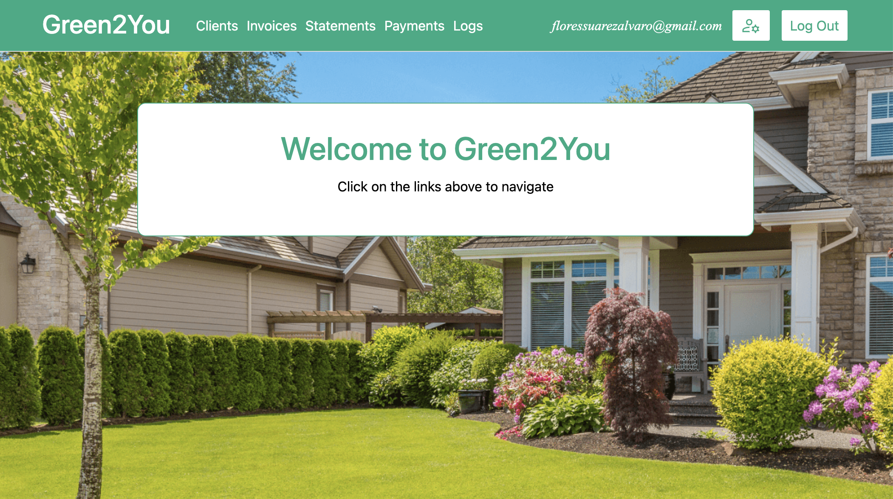

# Green2You - Billing Streamliner

This application is designed to help streamline billing processes, offering an efficient and user-friendly interface for managing invoices, statements, and payments. It was created to simplify and automate repetitive billing tasks.



[Click here for demo video](https://vimeo.com/1029354586)

### Table of Contents

1. [Features](#features)
2. [Technologies Used](#technologies-used)
3. [Installation](#installation)
4. [Environment Variables](#environment-variables)
5. [Usage](#usage)
6. [Contributing](#contributing)
7. [License](#license)

## Features

- Invoice Management: Easily create, edit, and track invoices.
- Automated Billing Statements: Generate PDF statements automatically based on customizable billing cycles.
- Payment Tracking: Keep track of payments and outstanding balances.
- User-Friendly Dashboard: View and manage all billing activities in one place.
- Email Notifications: Automatically notify clients of due invoices or statements.

## Technologies Used

- Frontend: React, HTML, CSS
- Backend: Node.js, Express
- Database: MongoDB
- Authentication: JWT tokens
- Environment Management: dotenv

## Installation

1. Clone the Repository:

   ```bash
   # bash
   git clone https://github.com/floressuarezalvaro/green2you.git
   ```

2. Install Dependencies for server and backend directories:

   ```bash
   # bash
   yarn install
   ```

3. Environment Variables:
   - Configure environment variables by createing a .env.development and .env.production files in the server directory with the following configuration:

   ```
    PORT=<your_port>
    MONGO_URI=<your_mongo_database_uri>
    JWTSECRET=<your_jwt_secret_key>
    EMAIL_USER=<your_email_for_notifications>
    EMAIL_PASS=<your_email_password>
    API_KEY=<your_api_key>
    FRONTEND_URL=<your_frontend_url>
   ```

4. Run the Application Locally:

   ```bash
   # bash
   yarn dev:server
   yarn dev:frontend
   ```

## Usage

- Register or log in to access your dashboard.
- Create new invoices, statements, or record payments.
- View summaries and client billing history.
- Configure email notifications for automated billing reminders.

## Contributing

Contributions are welcome! Please fork this repository, make your changes, and submit a pull request.

## License

Copyright (c) [2024] [Alvaro Flores Suarez]

Permission is hereby granted, free of charge, to any person obtaining a copy of this software and associated documentation files (the "Software"), to deal in the Software without restriction, including without limitation the rights to use, copy, modify, merge, publish, distribute, sublicense, and/or sell copies of the Software, and to permit persons to whom the Software is furnished to do so, subject to the following conditions:

The above copyright notice and this permission notice shall be included in all copies or substantial portions of the Software.

THE SOFTWARE IS PROVIDED "AS IS", WITHOUT WARRANTY OF ANY KIND, EXPRESS OR IMPLIED, INCLUDING BUT NOT LIMITED TO THE WARRANTIES OF MERCHANTABILITY, FITNESS FOR A PARTICULAR PURPOSE AND NONINFRINGEMENT. IN NO EVENT SHALL THE AUTHORS OR COPYRIGHT HOLDERS BE LIABLE FOR ANY CLAIM, DAMAGES OR OTHER LIABILITY, WHETHER IN AN ACTION OF CONTRACT, TORT OR OTHERWISE, ARISING FROM, OUT OF OR IN CONNECTION WITH THE SOFTWARE OR THE USE OR OTHER DEALINGS IN THE SOFTWARE.
